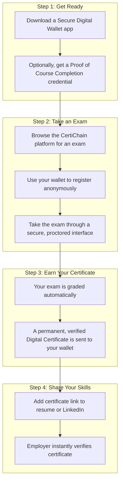

# CertiChain: A System for Verifiable Skills Certification
A decentralized protocol for issuing and verifying secure, fraud-proof skills certificates on the blockchain.

## 1. System Overview

CertiChain is a decentralized platform designed to help self-learners and students of open online courses prove their skills. It provides a way to take credible exams and earn secure, fraud-proof digital certificates that can be instantly verified by anyone, anywhere.

The system uses blockchain technology to act as a global, tamper-proof public record book. This ensures that once a certificate is earned, it is permanent, belongs entirely to the student, and cannot be altered or faked. It's an open and transparent alternative to traditional certification, built for the modern digital learner.

## 2. Who Is This For?

*   **Self-Learners & Online Students:** Individuals learning skills from platforms like Coursera, edX, YouTube, or other open courses who need a credible way to certify their knowledge and stand out to employers.
*   **Independent Educators & Experts:** Subject matter experts who want to create high-quality exams and be rewarded for their contributions to a global, open assessment standard.
*   **Employers & Recruiters:** Companies that need a fast, reliable, and free way to verify a candidate's qualifications without the administrative hassle of contacting institutions.

## 3. Core Components (The Technology Explained Simply)

CertiChain is built on a few key pillars. You don't need to understand the complex technology to use it, just what it does for you.

| Component | What It Is | What It Provides You |
| :--- | :--- | :--- |
| **Your Secure Digital Wallet** | A private digital backpack for your academic and professional credentials. It's an app you control on your phone or computer. | **Full Control & Privacy:** You alone hold your certificates and decide who to share them with. It's not tied to any single institution or platform. |
| **The Public Record Book (Blockchain)**| A global, transparent, and permanent database that is shared across thousands of computers, making it impossible to tamper with. | **Trust & Security:** When you earn a certificate, a record is added to this public book. This proves your achievement is authentic and permanent. It eliminates fraud. |
| **The Verified Digital Certificate**| A unique, fraud-proof certificate issued directly to your digital wallet. Think of it as a digital version of a paper certificate, but with superpowers. | **Instant Verification:** Anyone you share it with (like an employer) can verify it's real in seconds, just by scanning a QR code or clicking a link. |
| **The Privacy Key**| A special cryptographic tool that lets you prove you meet an exam's requirements (e.g., "I completed the prerequisite course") without revealing your identity or other data. | **Anonymous Registration:** You can sign up for exams privately, proving your eligibility without having to share personal information until you choose to. |

## 4. How It Works: A Student's Journey

Here’s how a self-learner would use the system from start to finish.

### **The Journey Explained**

1.  **Get Your Secure Wallet:** You start by setting up a digital wallet, which acts as your private backpack for your future credentials.
2.  **Find and Take an Exam:** You browse a marketplace of exams created by trusted educators. To register, you use your wallet to prove you're eligible without needing to create a traditional account with a username and password.
3.  **Receive Your Digital Certificate:** After passing the exam, the system automatically sends a secure, verified Digital Certificate to your wallet. It's yours forever.
4.  **Share with Employers:** When you apply for a job, you can include a simple, verifiable link to your certificate. The employer can click it and see undeniable proof of your skill, timestamped on the public blockchain.

## 5. Key Benefits At a Glance

| For Students | For Educators | For Employers |
| :--- | :--- | :--- |
| **Own Your Achievements:** Your certificates are truly yours, independent of any single institution. | **Global Reach:** Create exams for a worldwide audience of learners. | **Eliminate Fraud:** Instantly distinguish between authentic and fake credentials. |
| **Protect Your Privacy:** Prove eligibility without oversharing personal data. | **Get Rewarded:** Earn tokens for creating and validating high-quality exams. | **Save Time & Money:** No more manual background checks. Verification is free and instant. |
| **Gain Credibility:** Earn trusted, verifiable credentials for your self-taught skills. | **Build Reputation:** Become a recognized expert in a global, transparent system. | **Access a Wider Talent Pool:** Confidently hire skilled, self-taught individuals. |

## 6. Ensuring Quality: A Community-Driven Approach

A certificate is only as valuable as the exam behind it. CertiChain ensures high quality not through a central authority, but through a transparent community model.

1.  **Exam Creation:** Subject matter experts and qualified educators can create and submit exams to the platform.
2.  **Peer Validation:** Before an exam is made public, a pool of other verified educators in the same field reviews it for accuracy, fairness, and relevance. This is like the peer-review process for academic papers.
3.  **Reputation System:** Participants who consistently create high-quality exams or provide excellent validation build a strong public reputation. Students can use this reputation score to choose exams from the most trusted sources.

This model incentivizes everyone to maintain the highest standards, ensuring that a CertiChain certificate is a meaningful and respected credential.

## 7. The Technology Behind the Scenes

While you don't need to be a developer to use the system, it is built on a foundation of secure, open, and proven technologies. We believe in not reinventing the wheel and instead integrate industry-standard tools.

| Component | What it Does | Proven Technology We Use |
| :--- | :--- | :--- |
| **Identity Management** | Provides you with your secure digital wallet and credentials. | W3C Verifiable Credentials & DIDs |
| **Smart Contracts** | Automate the exam process, from grading to issuing certificates. | Ethereum (or a low-cost equivalent like Polygon) with OpenZeppelin standards. |
| **Privacy Proofs** | Let you prove things anonymously. | Zero-Knowledge Proofs (Circom/snarkjs toolchain). |
| **Decentralized Storage** | Stores encrypted exam materials securely. | InterPlanetary File System (IPFS). |
| **Community Governance** | Allows the community to vote on quality standards and platform rules. | DAO frameworks like Aragon or OpenZeppelin Governor. |

## 8. Project Roadmap

CertiChain is an evolving project. Our development is planned in phases to ensure a stable and useful rollout.

*   **Phase 1: Core Credentialing (Completed)**
    *   Develop the ability to issue and verify basic digital certificates.
    *   Integrate with popular digital wallets.

*   **Phase 2: Open Exam Marketplace (In Progress)**
    *   Launch the platform for educators to submit and validate exams.
    *   Implement the student-facing interface for finding and taking tests.

*   **Phase 3: Full Decentralization & Governance**
    *   Roll out the community-governed DAO for quality control.
    *   Introduce the reputation and reward system for educators.

*   **Future: Seamless Integrations**
    *   Build plugins and tools for popular learning platforms to issue credentials directly.
    *   Develop APIs for job platforms to integrate verification.

## 9. Get Involved

CertiChain is a community effort. Whether you're a student, teacher, or developer, you can help shape the future of verifiable skills.

*   **Educators:** We are actively looking for experts to help build our initial repository of high-quality exams.
*   **Developers:** The project is open-source. Check out our repositories and `CONTRIBUTING.md` to get started.
*   **Students & Self-Learners:** Use the platform, test our systems, and provide feedback to help us improve the experience for everyone.

Together, we can build a more trustworthy and equitable system for recognizing knowledge and skill, no matter how it was acquired.