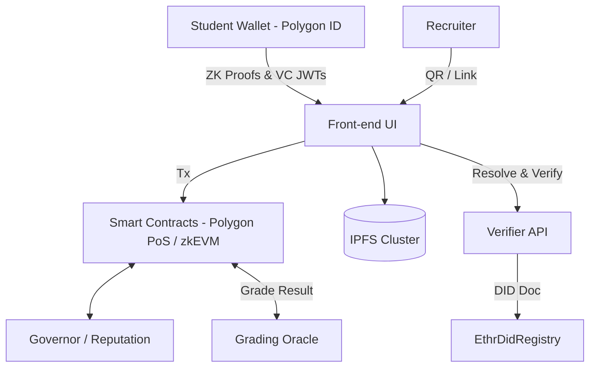

# CertiChain – Detailed Design Document

> **Path:** `documents/design.md`
> **Last updated:** <!-- KEEP THIS LINE FOR CI AUTO‑STAMP -->

---

## 1  Purpose & Scope

This document supplements **README.md** by describing the *why* and *how* behind CertiChain’s architecture. It is intended for contributors who need to understand the on‑chain contracts, the identity layer, the off‑chain services, and the data flows that tie everything together.

## 2  High‑Level Architecture



### 2.1 Component Groups

| Layer                  | Key Modules                                                                      | Responsibilities                                                                            |
| ---------------------- | -------------------------------------------------------------------------------- | ------------------------------------------------------------------------------------------- |
| **Identity & Wallet**  | Polygon ID mobile / Flutter SDK                                                  | Generates `did:polygonid` & `did:ethr`, stores keys, holds VCs, creates ZK proofs           |
| **Smart Contracts**    | `ExamRegistry`, `CredentialNFT`, `Reputation`, `DAO Governor`, `EthrDidRegistry` | Exam lifecycle, certificate minting, educator reputation & governance, DID document storage |
| **Off‑chain Services** | Grading Oracle, Verifier API                                                     | Auto‑grades exams, submits scores; verifies proofs for recruiters                           |
| **Storage**            | IPFS Cluster (3 nodes)                                                           | Encrypted questions, answer sheets, credential JSON‑LD payloads                             |

## 3  On‑Chain Contract Design

### 3.1 ExamRegistry.sol

```solidity
struct Exam {
    bytes32 ipfsHash;   // CID for exam meta
    uint16 passScore;   // threshold 0‑100
    uint256 fee;        // optional fee in MATIC
    address educator;   // creator DID controller
    bool active;
}
```

| Function            | Access         | Gas (avg) | Notes                                    |
| ------------------- | -------------- | --------- | ---------------------------------------- |
| `createExam`        | Educator       | \~350 k   | Emits `ExamCreated` (examId)             |
| `registerWithProof` | Student Wallet | \~200 k   | Verifies Polygon ID ZKP on‑chain         |
| `submitScore`       | Grading Oracle | \~110 k   | If `score ≥ passScore` mints certificate |

### 3.2 CredentialNFT.sol

ERC‑721 token where `tokenURI` == IPFS CID of VC JWT.<br>Implements `IERC5269` for off‑chain credential binding.

### 3.3 Reputation.sol

ERC‑20Votes token. Each accepted exam review mints `REP` to educator; `DAO Governor` counts `REP` for voting weight.

### 3.4 DAO Governor

OpenZeppelin Governor + TimelockControl managing:

* Exam activation / deactivation
* Oracle address rotation
* Fee schedule adjustments

## 4  Identity & Credential Layer

| Element    | Standard                                 | Implementation                                              |
| ---------- | ---------------------------------------- | ----------------------------------------------------------- |
| **DID**    | W3C DID Core                             | `did:polygonid:<network>:<hex>` + `did:ethr` fallback       |
| **VC**     | W3C Verifiable Credentials (JWT, ES256K) | Claims: `examId`, `score`, `tokenId`, `txHash`, `timestamp` |
| **Proofs** | ZK‑SNARK (Groth16)                       | Circom circuits from Polygon ID: *membership*, *range*      |

### 4.1 Prerequisite Proof Flow

1. Educator issues *Course‑Completion* VC → Student wallet.
2. Wallet generates ZK proof *“I possess a VC of schema X”*.
3. `registerWithProof` verifies proof and logs attendance anonymously.

## 5  Off‑Chain Service Details

### 5.1 Grading Oracle

* Listens to `ExamTaken` events via WebSocket (Alchemy).
* Runs auto‑grader (Python or Node TypeScript).
* Signs result using EIP‑712 and calls `submitScore`.
* Docker‑ised; deployed to Kubernetes CronJob for scalability.

### 5.2 Verifier API

Thin REST (Fastify) wrapping Polygon ID Verifier WASM; enables recruiters to POST a VC URL and receive *{"valid": true/false}*.

## 6  Storage Model (IPFS)

| CID Folder                     | Contents                   | Encryption             |
| ------------------------------ | -------------------------- | ---------------------- |
| `/exam/<examId>/meta.json`     | title, description, schema | public                 |
| `/exam/<examId>/questions.enc` | question bank zip          | AES‑256 (educator key) |
| `/credentials/<tokenId>.jwt`   | VC payload                 | none (JWT signed)      |

Pinning handled by Cluster peers + Pinata pin‑set; hash recorded on chain.

## 7  Security & Privacy Considerations

* Smart contracts audited with Slither + MythX
* Front‑end enforces CSP, uses EIP‑4361 Sign‑In‑With‑Ethereum
* Oracle keys rotated quarterly; timelocked *kill‑switch* in DAO
* Zero‑Knowledge proofs prevent linkage of prerequisite VCs and exam result
* Regular chain‑reorg resilience tests (Tenderly simulations)

## 8  Development & Deployment

| Stage     | Network                                        | Contracts Tag  | Notes                    |
| --------- | ---------------------------------------------- | -------------- | ------------------------ |
| **Local** | Hardhat (chain‑id 31337)                       | `dev‑snapshot` | Quick iteration          |
| **Test**  | Polygon Amoy                                   | `v0.x‑rc`      | Faucet MATIC via Alchemy |
| **Prod**  | Polygon PoS (137) + Polygon zkEVM Mainnet Beta | `v1.0`         | Final deployment         |

CI: GitHub Actions → Hardhat tests → Coverage ≥95 % → `npm run deploy`.

## 9  Future Enhancements

* **Bridged Anchoring**: daily Merkle root to Bitcoin via ION.
* **LMS Plugins**: LTI 1.3 plugin to emit VCs directly after course completion.
* **Social Recovery**: MPC wallets for key‑loss mitigation.
* **Mobile Offline Mode**: local verification without network connectivity (zk verifiers pre‑bundled).

## 10  Glossary

| Term      | Meaning                                |
| --------- | -------------------------------------- |
| **VC**    | Verifiable Credential                  |
| **ZKP**   | Zero‑Knowledge Proof                   |
| **PoS**   | Proof‑of‑Stake                         |
| **zkEVM** | Zero‑Knowledge roll‑up, EVM‑equivalent |
| **SID**   | Student Identifier DID                 |

---

**Contributing:** see `CONTRIBUTING.md` for coding guidelines and branch strategy.
